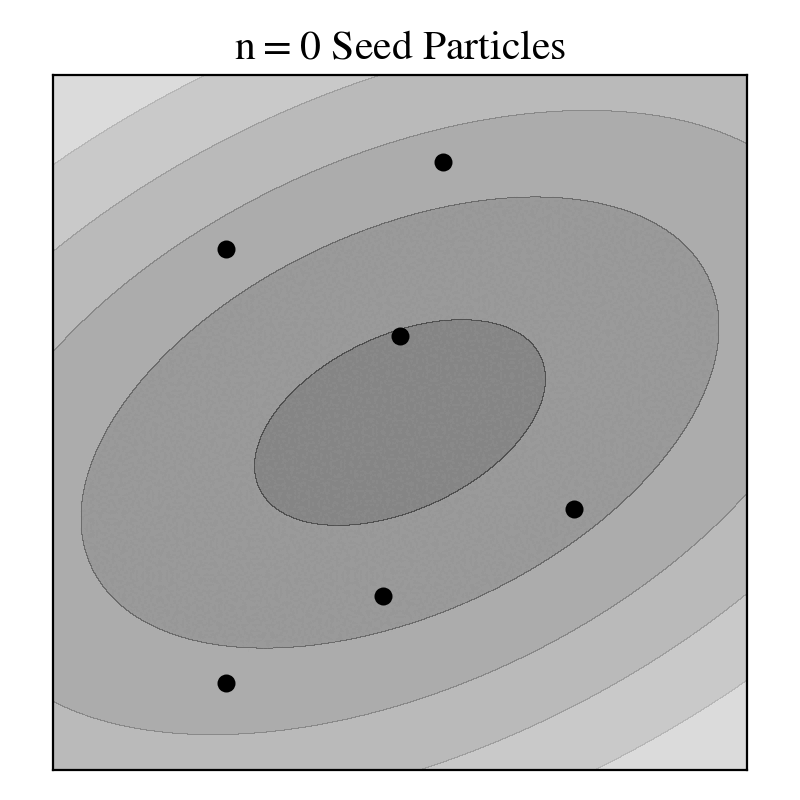

<p align="center">

</p>

# Integrator Snippets
Integrator Snippets are a novel class of algorithms to sample from a target distribution.
Suppose $\mu$ is a target distribution on $(\mathsf{Z}, \mathcal{Z})$ that we wish to sample from. Integrator Snippets construct a mixture

$$
\bar{\mu}(dz) = \sum_{k=0}^T \omega_k \mu^{\psi_k^{-1}}(dz),
$$

where $\psi_k:\mathsf{Z}\to\mathsf{Z}$ are invertible transformations, and leverage the powerful yet simple identity

$$
\bar{\mu}(f\circ \psi_k) = \mu(f),
$$

Integrator snippets are particle-based algorithms. We construct trajectories for each particles and then resample out of all these trajectory points.

<p align="center">

</p>

## Examples
A filamentary example requires only six components:
1. `Manifold`: the manifold around which the targets are concentrated.
2. `Integrator`: invertible function used to update particles.
3. `FilamentaryDistribution`: sequence of targets, superclass of `SequentialTargets`.
4. `Monitor`: monitors performance and termination.
5. `Adaptator`: adapts parameters of the integrators.
6. `MixtureWeights`: weights of the components of the mixture.
```python
from integrator_snippets.manifolds import Ellipsoid
from integrator_snippets.distributions import Filamentary
from integrator_snippets.integrators import AMIntegrator, IntegratorMixtureSameT
from integrator_snippets.monitoring import MonitorMixtureIntSnippet, MonitorSingleIntSnippet
from integrator_snippets.adaptation import DummyAdaptation, MixtureStepSizeAdaptorSA, SingleStepSizeAdaptorSA
from integrator_snippets.samplers import MixtureIntegratorSnippetSameT
from integrator_snippets.mixture_weights import UniformMixtureWeights
import numpy as np

# Settings
T = 20  # number of integration steps
thug_step_size = 0.1
snug_step_size = 0.1

# Manifold is an ellipsoid centered at the origin
ellipsoid = Ellipsoid(mu=np.zeros(2), cov=np.diag([1, 0.1]), z=0.05)

# Mixture of THUG and SNUG (80% of the times we use THUG)
thug = AMIntegrator(d=2, T=T, step_size=thug_step_size, int_type='thug')
snug = AMIntegrator(d=2, T=T, step_size=snug_step_size, int_type='snug')
integrators = IntegratorMixtureSameT(thug, snug, mixture_probabilities=np.array([0.8, 0.2]))

# Targets are filamentary distributions, using a uniform kernel
targets = Filamentary(manifold=ellipsoid, eps=np.inf, kernel='uniform', coeff=1.0)
targets.base_log_dens_x = lambda x: -0.5*(np.linalg.norm(x, axis=-1)**2)
targets.sample_initial_particles = lambda n_particles: np.random.randn(n_particles, 2)
targets.log_dens_aux = thug.eval_aux_logdens

# Monitor each integrator separately, terminate based on 'pm' metric
thug_monitor = MonitorSingleIntSnippet(terminal_metric=1e-2, metric='pm')
snug_monitor = MonitorSingleIntSnippet(terminal_metric=1e-2, metric='pm')
monitors = MonitorMixtureIntSnippet(thug_monitor, snug_monitor)

# Adapt the step size of SNUG but keep the one of THUG fixed
thug_adaptator = DummyAdaptation()
snug_adaptator = SingleStepSizeAdaptorSA(
  target_metric_value=0.5, metric='mip', max_step=10., min_step=0.000001, lr=0.5)
adaptators = MixtureStepSizeAdaptorSA(thug_adaptator, snug_adaptator)

# Mixture weights are uniform and are not learned
mix_weights = UniformMixtureWeights(T=T)

# Gibbs Hug Markov Snippet (GHUMS) sampler
ghums = MixtureIntegratorSnippetSameT(
  N=1000, int_mixture=integrators, targets=targets, monitors=monitors,
  adaptators=adaptators, mixture_weights=mix_weights, max_iter=5000,
  verbose=True, plot_every=100)
sampling_output = ghums.sample()
```

## TO-DO
1. Implement tempered distributions with automatic tempering based on ESS
2. Implement mixture of integrators with different $T_i$'s

## Structure

---
### `integrator_snippets.py`
Classes for **unfolded** integrator snippets.
- `SingleIntegratorSnippet`: trajectories are constructed with a single integrator $\psi:\mathsf{Z}\to\mathsf{Z}$ with step size $\delta>0$.
- `MixtureIntegratorSnippetSameT`: trajectories are constructed using multiple integrators $\psi_1, \ldots, \psi_I:\mathsf{Z}\to\mathsf{Z}$. All integrators are run for the same number of steps $T\in\mathbb{Z}_+$ but possibly different step sizes.
---
### `integrators.py`
Classes to define integrators.
- `Integrator`: use it to create a new integrator, which can then be used either as $\psi$ in `SingleIntegratorSnippet` or as one of the integrators in `MixtureIntegratorSnippetSameT`. Two examples are already implemented:
  - `LeapfrogIntegrator`: classic HMC Leapfrog integrator.
  - `AMIntegrator`: THUG and SNUG integrators (or a mixture of them).
- `IntegratorMixtureSameT`: class used to collect together a bunch of integrators, so that they can be passed to `MixtureIntegratorSnippetSameT`. For instance, one may wish to create a THUG integrator and a SNUG integrator and use them jointly.
---
### `distributions.py`
Classes to define target distributions. Filamentary distributions

$$
\pi_\epsilon(dx) \propto k_\epsilon(f(x)) \pi(dx), \qquad \epsilon > 0
$$

where $\pi(dx)$ is a distribution on $(\mathbb{R}^d, \mathcal{B}(\mathbb{R}^d))$, $f:\mathbb{R}^n\to\mathbb{R}^m$ is a smooth function with $n > m$, $k_\epsilon:\mathbb{R}\to\mathbb{R}_+$ is a kernel function (or more appropriately an approximation to the identity) with tolerance $\epsilon>0$ are fully implemented.
Tempered distributions are still under development.

---

### `monitoring.py`
Classes to monitor the performance and track the execution/termination of integrator snippets. 
Computes metrics such as the proportion of particles moved, the median index proportion and many others. It has been built to be very flexible.

---

### `adaptation.py`
Classes to adapt parameters of integrators (both single and mixtures of integrators).
It is possible to adapt both the step size and the number of integration steps, e.g. `SingleStepSizeSATMinAdaptor`.

---

### `mixture_weights.py`
Classes to define weights for the mixture $\bar{\mu}$. In the paper we mostly consider uniform weights $\omega_k = (T+1)^{-1}$, which corresponds to `UniformMixtureWeights`. However, more complicated options are available here and indeed we allow full user flexibility and allow the possibility of adaptation of these weights.
Dependence of the mixture weights on the position, i.e. $\omega_k(z)$ has not yet been implemented.

